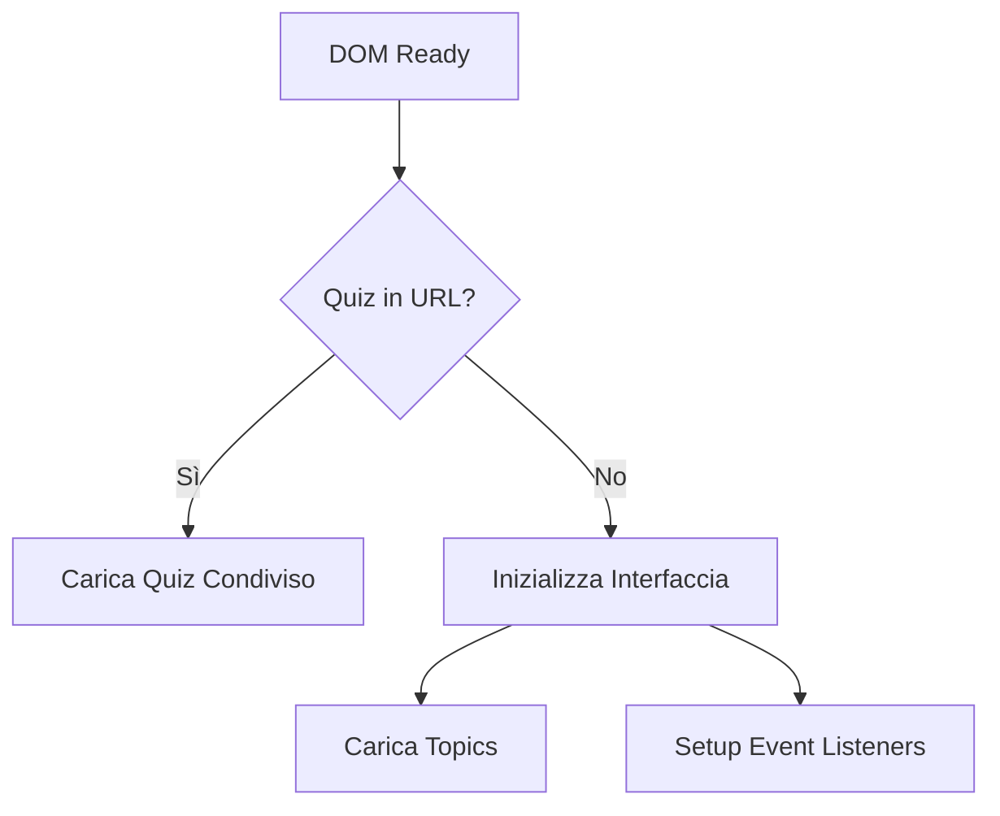
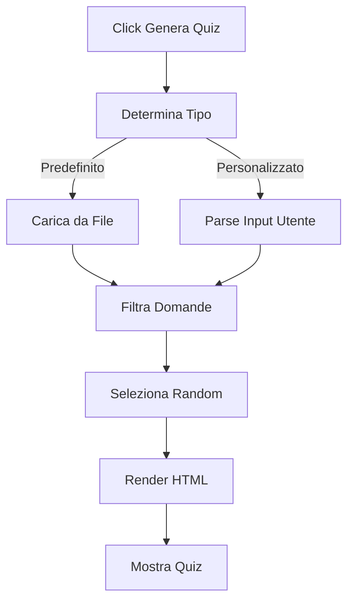
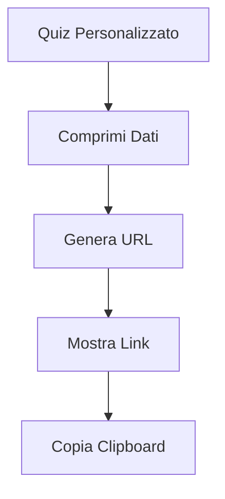

# Documentazione Tecnica

## Architettura del Progetto

### Overview
GitHub Copilot Quiz è un'applicazione web client-side costruita con tecnologie web standard, senza dipendenze backend.

### Stack Tecnologico
- **Frontend**: HTML5, CSS3, Vanilla JavaScript (ES6+)
- **Librerie Esterne**: 
  - YAML.js (parsing YAML)
  - Pako (compressione per condivisione URL)
- **Hosting**: GitHub Pages
- **Build**: Nessun processo di build richiesto

## Struttura del Progetto

```
├── index.html                 # Entry point dell'applicazione
├── src/
│   ├── js/                   # Moduli JavaScript
│   │   ├── main.js          # Inizializzazione app
│   │   ├── quiz-generator.js # Logica generazione quiz
│   │   ├── quiz-loader.js   # Caricamento dati quiz
│   │   ├── quiz-sharing.js  # Condivisione URL
│   │   └── ui-manager.js    # Gestione interfaccia
│   └── styles/
│       └── style.css        # Stili dell'applicazione
├── data/                    # Dati dei quiz
│   ├── quizzes-topics.json
│   ├── GCP-quizzes-query.json
│   └── MongoDB-JD-Associate-quizzes-query.yaml
├── docs/                    # Documentazione
└── .kiro/                   # Configurazione Kiro AI
```

## Moduli JavaScript

### main.js
**Responsabilità**: Inizializzazione dell'applicazione e gestione eventi principali.

**Funzioni principali**:
- Inizializzazione DOM con controllo URL per quiz condivisi
- Gestione automatica di quiz condivisi tramite URL
- Event listener per generazione quiz con supporto multi-tab
- Integrazione con tutti i moduli dell'applicazione

```javascript
// Inizializzazione dell'applicazione con supporto quiz condivisi
document.addEventListener('DOMContentLoaded', async () => {
  const urlQuiz = getQuizFromUrl();
  if (urlQuiz) {
    hideTabsAndShowQuiz();
    await loadQuizData('shared', form, resultsDiv, submitBtn, { generateQuiz });
  } else {
    initializeTabs();
    initializeTopics();
  }
  
  // Event listener per tutti i pulsanti di generazione
  document.querySelectorAll('.genBtn').forEach(btn => {
    btn.onclick = () => {
      const tabId = btn.closest('.tab-content').id.replace('Quiz', '');
      loadQuizData(tabId, form, resultsDiv, submitBtn, { generateQuiz });
    };
  });
});
```

### ui-manager.js
**Responsabilità**: Gestione dello stato dell'interfaccia utente e navigazione.

**Funzioni principali**:
- `initializeTabs()`: Gestione navigazione tra tab con event listeners
- `switchTab()`: Cambio tab con gestione stato attivo e nascondimento quiz
- `initializeTopics()`: Popolamento dinamico dropdown argomenti da JSON
- `hideTabsAndShowQuiz()`: Modalità quiz condiviso con nascondimento interfaccia
- Gestione stato UI reattiva per diverse modalità (normale/condiviso)
- Caricamento dinamico topic con esclusione opzioni custom
- Controllo visibilità elementi basato su contesto applicazione

### quiz-loader.js
**Responsabilità**: Caricamento e processamento dati quiz multi-formato.

**Funzioni principali**:
- `loadQuizData()`: Gestione caricamento con supporto per quiz condivisi
- `parseResponse()`: Parsing automatico JSON/YAML basato su estensione file
- `handleCustomQuiz()`: Processamento quiz personalizzati con validazione
- Gestione quiz condivisi da URL con bypass randomizzazione
- Validazione automatica formato dati e campi obbligatori
- Generazione automatica link condivisibili per quiz custom
- Opzione svuotamento automatico campo dopo generazione
- Gestione errori dettagliata con messaggi user-friendly
- Supporto per selezione numero domande configurabile

### quiz-generator.js
**Responsabilità**: Generazione e rendering quiz con sistema di punteggio avanzato.

**Funzioni principali**:
- `generateQuiz()`: Generazione quiz con supporto randomizzazione configurabile
- `filterQuestions()`: Filtro domande per origine (esclusione Copilot & GPT)
- Selezione intelligente del numero di domande da dropdown appropriato
- Rendering HTML dinamico con supporto per:
  - Domande a risposta singola (radio buttons)
  - Domande a risposta multipla (checkboxes) con indicatori visivi
  - Blocchi di codice formattati con syntax highlighting
- Sistema di punteggio sofisticato:
  - Riconoscimento risposte completamente corrette (verde)
  - Gestione risposte non date ma corrette (bordo grigio tratteggiato)
  - Feedback visivo per risposte incorrette (rosso con strikethrough)
- Disabilitazione automatica input dopo submission

### quiz-sharing.js
**Responsabilità**: Funzionalità di condivisione quiz con compressione avanzata.

**Funzioni principali**:
- `generateQuizLink()`: Compressione dati quiz usando Pako deflate
- `getQuizFromUrl()`: Decompressione e parsing dati da URL
- `showQuizLink()`: Visualizzazione link con funzionalità copia
- Conversione Base64 URL-safe per compatibilità browser
- Gestione errori robusta per dati corrotti
- Supporto per metadata quiz (timestamp, tipo, ecc.)
- Ottimizzazione dimensione URL per condivisione efficiente

## Formato Dati

### Schema Quiz Topics
```json
[
  {
    "title": "GitHub Copilot",
    "description": "Quizzes about GitHub Copilot certification.",
    "resource": "data/GCP-quizzes-query.json"
  },
  {
    "title": "MongoDB Java Developer Associate", 
    "description": "Quizzes about MongoDB and Java development.",
    "resource": "data/MongoDB-JD-Associate-quizzes-query.yaml"
  }
]
```

### Schema Domande Quiz
```json
{
  "domanda": "string (testo della domanda)",
  "risposte": {
    "a": "string (prima opzione)",
    "b": "string (seconda opzione)", 
    "c": "string (terza opzione)",
    "d": "string (quarta opzione)"
  },
  "rispostaCorretta": "string | array (es: 'a' o ['a', 'd'])",
  "origin": "string (fonte: mongodbUniversity, copilot, GPT, URL)",
  "codeBlock": "string (optional - codice formattato con YAML literal syntax)"
}
```

### Esempi Reali

**Domanda Semplice:**
```json
{
  "domanda": "What is GitHub Copilot?",
  "risposte": {
    "a": "A version control system",
    "b": "An AI pair programmer",
    "c": "A hosting service", 
    "d": "A code editor"
  },
  "rispostaCorretta": "b",
  "origin": "https://learn.microsoft.com/training/paths/copilot/"
}
```

**Domanda Multipla con Codice:**
```yaml
- domanda: "Given the following documents, which two can be added to the same collection?"
  codeBlock: |
      { _id: 1, n: [1,2,5], p: 0.75, c: 'Green' },
      { _id: 2, n: 'Orange', p: 'Blue', c: 42, q: 14 }
  risposte:
    a: "{ _id: 1, n: [1,2,5], p: 0.75, c: 'Green' }"
    b: "{ _id: 5, n: [1,2,5], p: 0.75, c: 'Green' }"
    c: "{ _id: 2, n: [1,2,5], p: 0.75, c: 'Green' }"
    d: "{ _id: 6, n: [1,3,7], p: 0.85, c: 'Orange' }"
  rispostaCorretta: ["b", "d"]
  origin: "mongodbUniversity"
```

## Flusso dell'Applicazione

### 1. Inizializzazione


### 2. Generazione Quiz


### 3. Condivisione Quiz


## Sviluppo Locale

### Prerequisiti
- Browser moderno con supporto ES6 modules
- Server HTTP locale (opzionale ma raccomandato)

### Setup Ambiente
```bash
# Clona repository
git clone <repository-url>
cd github-copilot-quiz

# Avvia server locale (scegli uno)
python -m http.server 8000
# oppure
npx serve .
# oppure
php -S localhost:8000
```

### Struttura Development
```bash
# File principali da modificare
src/js/           # Logica applicazione
src/styles/       # Stili CSS
data/            # Dati quiz
index.html       # Struttura HTML
```

## Testing

### Test Manuali
1. **Funzionalità Base**:
   - [ ] Caricamento quiz predefiniti
   - [ ] Creazione quiz personalizzati
   - [ ] Condivisione URL
   - [ ] Calcolo punteggi

2. **Compatibilità Browser**:
   - [ ] Chrome/Chromium
   - [ ] Firefox
   - [ ] Safari
   - [ ] Edge

3. **Responsive Design**:
   - [ ] Desktop (1920x1080)
   - [ ] Tablet (768x1024)
   - [ ] Mobile (375x667)

### Validazione Dati
```javascript
// Esempio validazione formato quiz
function validateQuizData(data) {
  return data.every(question => 
    question.domanda &&
    question.risposte &&
    question.rispostaCorretta &&
    question.origin
  );
}
```

## Deployment

### GitHub Pages
L'applicazione è configurata per il deployment automatico su GitHub Pages.

**Configurazione**:
1. Repository settings → Pages
2. Source: Deploy from branch
3. Branch: main / (root)

**URL Pattern**: `https://username.github.io/repository-name`

### File Statici
Tutti i file sono serviti staticamente:
- HTML, CSS, JS serviti direttamente
- JSON/YAML caricati via fetch API
- Nessuna elaborazione server-side richiesta

## Performance

### Ottimizzazioni Implementate
- **Lazy Loading**: Dati quiz caricati on-demand tramite fetch API
- **Compressione URL**: Pako deflate per ridurre dimensione link condivisi (fino a 80% riduzione)
- **Caching Browser**: Headers appropriati per risorse statiche
- **Moduli ES6**: Caricamento efficiente con import/export
- **DOM Manipulation**: Rendering ottimizzato con innerHTML batch updates
- **Event Delegation**: Event listener efficienti per elementi dinamici

### Metriche Target
- **First Contentful Paint**: < 1.5s
- **Largest Contentful Paint**: < 2.5s  
- **Cumulative Layout Shift**: < 0.1
- **First Input Delay**: < 100ms
- **Quiz Generation**: < 500ms per 30 domande
- **URL Compression**: < 100ms per quiz tipico

### Dati Quiz Attuali
- **GitHub Copilot**: File JSON con domande su certificazione e Responsible AI
- **MongoDB Java Developer Associate**: File YAML con domande su sviluppo MongoDB
- **Formato Supportato**: JSON e YAML con parsing automatico basato su estensione

## Sicurezza

### Considerazioni Client-Side
- **XSS Prevention**: Sanitizzazione input utente
- **Content Security Policy**: Headers appropriati
- **HTTPS Only**: Forzato su GitHub Pages
- **No Sensitive Data**: Nessun dato sensibile nel client

### Validazione Input
```javascript
// Sanitizzazione input personalizzato
function sanitizeInput(input) {
  return input
    .replace(/</g, '&lt;')
    .replace(/>/g, '&gt;')
    .replace(/"/g, '&quot;');
}
```

## Troubleshooting

### Problemi Comuni

**Quiz non si carica**:
- Verifica connessione internet
- Controlla console browser per errori
- Valida formato JSON/YAML

**Link condivisione non funziona**:
- Verifica lunghezza URL (limite browser ~2000 caratteri)
- Controlla compressione dati
- Testa decompressione

**Errori JavaScript**:
- Verifica supporto ES6 modules
- Controlla CORS policy per file locali
- Usa server HTTP per sviluppo locale

### Debug Tools
```javascript
// Abilita debug mode
localStorage.setItem('quiz-debug', 'true');

// Log dettagliato
console.log('Quiz data:', quizData);
console.log('Selected questions:', selectedQuestions);
```

## Contribuire

### Workflow Sviluppo
1. Fork repository
2. Crea feature branch
3. Implementa modifiche
4. Testa localmente
5. Commit e push
6. Apri Pull Request

### Code Style
- **JavaScript**: ES6+, camelCase
- **CSS**: BEM methodology, kebab-case
- **HTML**: Semantic markup, lowercase attributes
- **Indentazione**: 2 spazi

### Commit Messages
```
feat: add new quiz topic support
fix: resolve URL sharing compression issue
docs: update technical documentation
style: improve responsive design
```

---

[← Guida Contenuti](content-guide.md) | [Torna alla Home](../README.md)